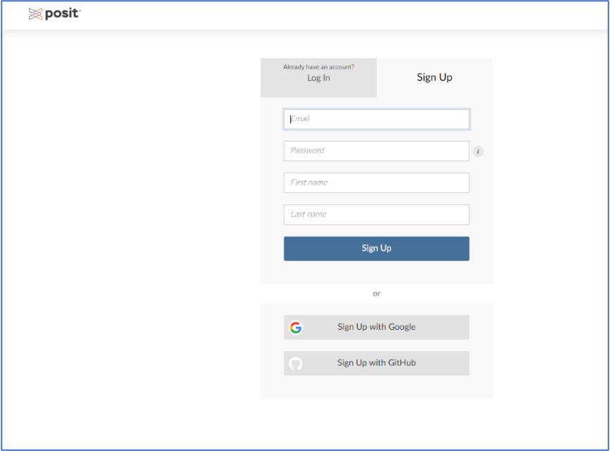
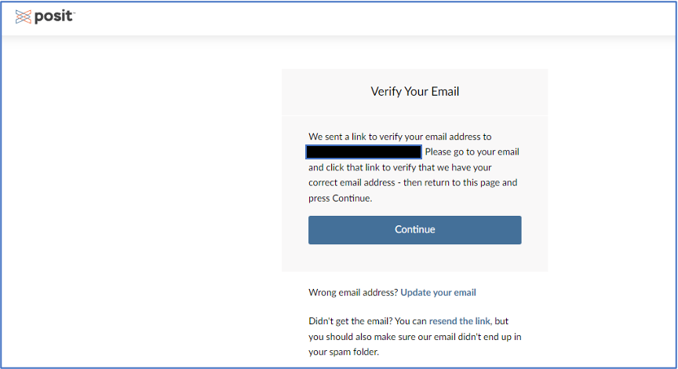
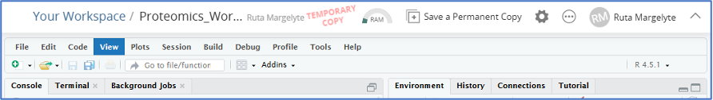
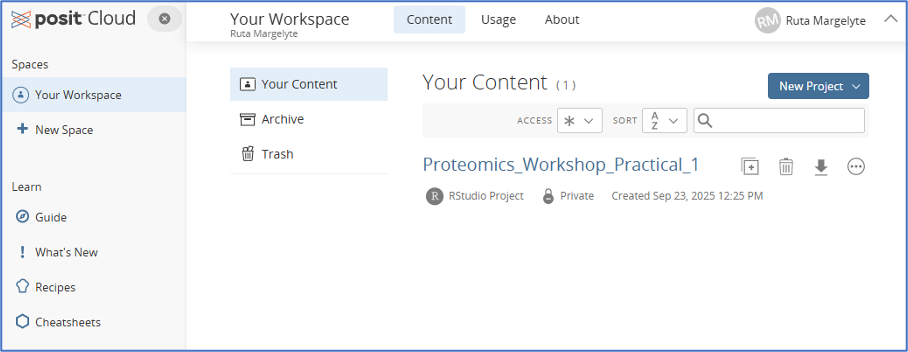
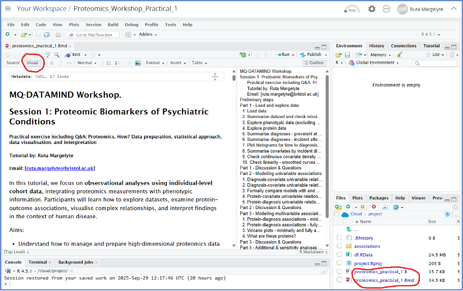

proteomics_paractical_1
================
Ruta Margelyte
2025-09-22

It is easiest to run R practical within our Posit Cloud space (what used
to be called RStudio Cloud), which by default will have the correct R
version and packages installed. To join our Posit Cloud, please go to
the following link: [Posit
Cloud](https://posit.cloud/spaces/232842/join?access_code=VsT9IA2ou_hXs3nQr9UY3WrVdCuLqiUnMQmT8d7l),
where you will be prompted to create an account at the sign in screen.

How to use the Posit Cloud

-   Once you have clicked the link above, if you do not already have a
    Posit Cloud account, click on the right-hand tab (“Sign Up”) to
    create an account

-   Fill in your details and you’ll see the following message

-   Open a new tab, go to your email inbox and click on the verify email
    address link

-   Go back to the browser tab with the “Verify Your Email” message
    above and click “Continue”.

-   Click the link [Proteomics_Workshop_Practical_1 - Posit
    Cloud](https://posit.cloud/content/10981075) to access practical
    materials in the Posit Could. Alternatively, copy this URL into your
    browser address bar <https://posit.cloud/content/10981075>

-   Once link is open and materials loaded, on the right-hand side click
    on “Save a Permanent Copy” to download the practical materials into
    “Your workspace”.

-   On the left-hand side, click on “Your Workspace”, then on the
    Content tab click on the practical session. You should find that
    RStudio opens within your browser window.

-   Within the practical session you can see in the Files pane (on the
    bottom right-hand side) all the files required for the practical.
    You can now run/edit these files as you wish.

    – Open either the .Rmd (recommended) or .R file depending upon your
    preference.

    – Choose “Visual” display setting in the .Rmd files to show
    formatted text.

    – Note if you do not have R packages installed required in this
    session, you will need to uncomment the install.packages() function
    calls.

    – After editing the files, your changes will be automatically saved
    in the permanent copy of the practical under “Your Workspace” in
    your personal RStudio Cloud account

