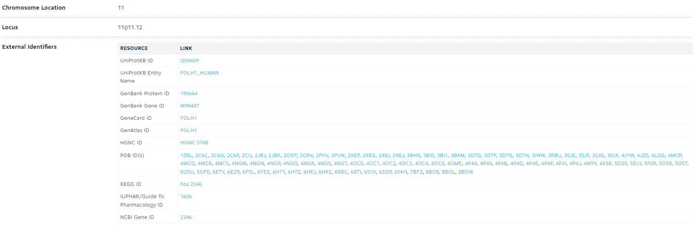

Welcome! This is the repository for the MQ-DATAMIND workshop, 'Proteomics and Mental Health' (Practical Session II)

# Aim of the session

We will use two-sample Mendelian randomisation to test causal relationship between protein abundance and bipolar disorder. Through this tutorial, you will gain hands-on experience in handling and performing quality check on pQTL and other types of GWAS sumstats. You will also learn how to run and interpret Mendelian Randomisation findings, and how to consolidate causal evidence using colocalisation analysis.

We will focus on one protein, FOLH1 (Folate hydrolase 1, also known as prostate-specific membrane antigen, PSMA), which has been implicated in bipolar disorder by a recent Mendelian randomisation study published in JAMA Psychiatry (Bhattacharyya U. et al. Circulating Blood-Based Proteins in Psychopathology and Cognition: A Mendelian Randomization Study). We will use FOLH1 as an example to illustrate the analysis workflow, followed by functional lookup using OpenTargets. You can then apply the same workflow to other proteins of your interest.

# Data used in this tutorial and relevant readings

------------------------------------------------------------------------

We will use publicly available summary statistics from the [Psychiatric Genomic Consortium](https://pgc.unc.edu/for-researchers/download-results/) and pQTL data from [deCODE](https://www.decode.com/summarydata/) (Ferkingstad, E. et al. Large-scale integration of the plasma proteome with genetics and disease). Note that the complete pQTL data requires a simple access sign up. You can download your own version for your analysis following the link, or you could follow this tutorial using a local copy of pre-processed pQTL data.

Readings:

-   **Mendelian Randomisation analysis**: Bhattacharyya U, John J, Lam M, Fisher J, Sun B, Baird D, Burgess S, Chen CY, Lencz T. Circulating Blood-Based Proteins in Psychopathology and Cognition: A Mendelian Randomization Study. JAMA Psychiatry. 2025 May 1;82(5):481-491. https://doi.org/10.1001/jamapsychiatry.2025.0033.

# Environment set up and data used in this tutorial

------------------------------------------------------------------------

## Clone this github repo

Use the script below to clone this github repository on your local machine:

```{bash, eval=F, echo=T}
git clone https://github.com/xshen796/Proteomics_Workshop_Practical.git
```

## Set up your R environment to access OpenGWAS data

💡See a quick guide here if you haven't done so: [URL](https://github.com/xshen796/Proteomics_Workshop_Practical/blob/main/Session_ii/Setup_APItoken.md)

## Data used in this tutorial

**See [here](https://github.com/xshen796/Proteomics_Workshop_Practical/blob/main/prep/data_prep.md) if you need more information on how we accessed and prepared the data for this tutorial.**


# Two-sample MR: testing causal effect of Glutamate carboxypeptidase 2 (encoded by ***FOLH1***) to bipolar disorder using cis pQTL

------------------------------------------------------------------------

## Load R packages

```{r,warning=F,message=F}
library(rmarkdown)
library(dplyr)
library(data.table)
library(pbapply)
library(readr)
library(here)
library(knitr)
library(TwoSampleMR)
library(coloc)
library(locuszoomr)
library(EnsDb.Hsapiens.v75)
```

## Load data

Let's first load bipolar disorder GWAS sumstats and pQTL data

```{r load sumstats,message=F,warning=F,echo=T}
dat.bp_gwas = read_tsv('https://storage.googleapis.com/mhp-proteomic-sumstats/bp_2024_chr7_11.tsv.gz')

dat.pqtl_folh1 = read_tsv('https://storage.googleapis.com/mhp-proteomic-sumstats/Proteomics_SMP_PC0_5478_50_FOLH1_PSMA_10032022_lo_annot.txt.gz')
```

Let's load protein annotation and see which proteins we will be looking at

```{r load annotation,message=F,echo=T}
ref.somalogic = read_tsv(here::here('utils/ref_somalogic.tsv')) %>%
    dplyr::select(SeqId,UniProt,Protein_full_name,Gene,Ensembl_Gene_ID)

knitr::kable(ref.somalogic, "pipe")
```

Here in this table:

-   SeqID: unique protein identifier of SOMALogic assay

-   UniProt, Protein_full_name: Uniprot ID and full name of the protein

-   Gene, Ensembl_Gene_ID: Gene symbol and Ensembl ID

## QC and prepare pQTL data (protein as exposure)

➡️ We need to select the cis region of ***FOLH1***. Find genomic locations for ***FOLH1*** [here](https://www.genecards.org/cgi-bin/carddisp.pl?gene=FOLH1&keywords=FOLH1)

Our genome build is **GRCh37/hg19**.


```{r,eval=T,message=F,echo=T}
gene_boundary = data.frame(lower=49166644,upper=49230154)
gene_chr = 11
```

Select cis region sumstats: 1Mb extended area of the gene region

```{r,eval=T,message=F,echo=T}
dat.cis_pqtl_folh1 = dat.pqtl_folh1 %>% 
  dplyr::filter(CHR==gene_chr,BP > (gene_boundary$lower - 1000000), BP < (gene_boundary$upper + 1000000))
```

Double check if data only includes cis region

```{r,eval=T,message=F,echo=T}
range(dat.cis_pqtl_folh1$BP)
```

➡️ Keep common variants.

```{r,eval=T,message=F,echo=T}
dat.cis_pqtl_folh1 = dat.cis_pqtl_folh1 %>% dplyr::filter(eaf < 0.995, eaf > 0.005)
```

➡️ Keep variants that also present in the bipolar disorder GWAS sumstats.

```{r,message=F,warning=F}
dat.cis_pqtl_folh1 = dat.cis_pqtl_folh1 %>% dplyr::filter(SNP %in% dat.bp_gwas$SNP)
```

➡️ Select genome-wide significant genetic instruments (pval \< 5e-8).

```{r,eval=T,message=F,echo=T}
dat.cis_sig_pqtl_folh1 = dat.cis_pqtl_folh1 %>% 
  dplyr::filter(pval<5e-8)
```

➡️ Clump data using the 1000 Genome central European genotype data as reference.

```{r,eval=T,message=F,echo=T}
dat.cis_sig_clump_pqtl_folh1 = dat.cis_sig_pqtl_folh1 %>% 
  clump_data(.,clump_kb=1000,clump_r2=0.001) %>%
  as.data.frame
```

If you see any error message, it is likely that you have not set up your R environment correctly. See this [tutorial](https://github.com/xshen796/Proteomics_Workshop_Practical/blob/main/Session_ii/Setup_APItoken.md).

➡️ Reformat exposure data (pQTL)

```{r,warning=F,message=F}
dat.exposure.folh1 = format_data(dat.cis_sig_clump_pqtl_folh1,type='exposure')
```

## QC and prepare schizophrenia sumstats (schizophrenia as outcome)

```{r, format bp gwas,eval=T,message=F,echo=T}
dat.bp.outcome = dat.bp_gwas %>% data.frame %>%
  format_data(.,type='outcome') 
```

## Harmonise exposure and outcome data

Harmonise exposure and outcome data. Select the top SNP for Wald ratio test.

```{r, data harmonisation,eval=T,echo=T}
dat.mr =  harmonise_data(dat.exposure.folh1,dat.bp.outcome) %>%
    arrange(pval.exposure) %>%
    head(n=1)
```

## Run two-sample Mendelian randomisation (Wald ratio and Steiger directionality tests)

➡️ Use the script below to run Wald ratio test. See result below:

```{r,eval=T,echo=T}
MR.wr=mr_wald_ratio(b_exp = dat.mr$beta.exposure,
                   b_out = dat.mr$beta.outcome,
                   se_exp = dat.mr$se.exposure,
                   se_out = dat.mr$se.outcome)  

MR.wr 
```

➡️ Use the script below to run MR Steiger directionality test. Here, we use it as a complementary analysis to Wald ratio.

```{r mr steiger, message=F,warning=F,echo=T,eval=T}
MR.dir = directionality_test(dat.mr)
MR.dir %>% knitr::kable(.)
```

# Colocalisation: consolidating causal evidence

------------------------------------------------------------------------

We will use the cis region pQTL data generated above for MR analyses for colocalisation analysis. This time, we will use all the SNPs within the cis region.

➡️ Get cis pqtl data and BP GWAS sumstats and reformat for data harmonisation

```{r prepare cis pqtl data, message=F,warning=F,echo=T,eval=T}
dat.coloc.pqtl = dat.cis_pqtl_folh1 %>%
      dplyr::select(SNP,CHR,BP,effect_allele.prot=effect_allele,other_allele.prot=other_allele,
                eaf.prot=eaf,beta.prot=beta,se.prot=se,
                pval.prot=pval,samplesize.prot=samplesize,Phenotype.prot=Phenotype) %>%
      mutate(CHR=as.numeric(CHR))
```

```{r prepare bp sumstats, message=F,warning=F,echo=T,eval=T}
dat.coloc.bp = dat.bp_gwas %>%
      dplyr::select(SNP,CHR,BP,effect_allele.bp=effect_allele,other_allele.bp=other_allele,
                eaf.bp=eaf,beta.bp=beta,se.bp=se,
                pval.bp=pval,samplesize.bp=samplesize,Phenotype.bp=Phenotype)
```

➡️ Merge pqtl and bp GWAS data

```{r merge pqtl and bp data, message=F,warning=F,echo=T,eval=T}
dat.coloc.merge = left_join(dat.coloc.pqtl,dat.coloc.bp,by=c('SNP','CHR','BP')) 
```

➡️ Align alleles

```{r coloc data harmonisation, message=F,warning=F,echo=T,eval=T}
dat.coloc.merge_align = dat.coloc.merge %>% 
      mutate(ea.prot.aligned = ifelse(eaf.prot < 0.5, effect_allele.prot,other_allele.prot),
             nea.prot.aligned = ifelse(eaf.prot < 0.5, other_allele.prot,effect_allele.prot),
             maf.prot = ifelse(eaf.prot < 0.5, eaf.prot,1-eaf.prot),
             beta.prot.aligned = ifelse(eaf.prot < 0.5, beta.prot,-beta.prot)) %>% 
      mutate(ea.bp.aligned = ifelse(eaf.bp < 0.5, effect_allele.bp,other_allele.bp),
             nea.bp.aligned = ifelse(eaf.bp < 0.5, other_allele.bp,effect_allele.bp),
             maf.bp = ifelse(eaf.bp < 0.5, eaf.bp,1-eaf.bp),
             beta.bp.aligned = ifelse(eaf.bp < 0.5, beta.bp,-beta.bp)) %>% 
      mutate(flipped = ea.prot.aligned!=ea.bp.aligned) %>% 
      dplyr::filter(!is.na(pval.bp),maf.bp>0.001) %>% 
      .[!duplicated(.$SNP),]

sum.flipped = sum(dat.coloc.merge_align$flipped)
```

➡️ Format data for SuSie colocalisation analysis

```{r create D1 and D2 for susie colocalisation, message=F,warning=F,echo=T,eval=T}
D1 <- list(
             type = "quant", # quantitative trait
             beta = dat.coloc.merge_align$beta.prot.aligned,
             varbeta = dat.coloc.merge_align$se.prot^2, # note that this is standard error squared
             pvalues = dat.coloc.merge_align$pval.prot,
             N = dat.coloc.merge_align$samplesize.prot,
             MAF = dat.coloc.merge_align$maf.prot,
             snp = dat.coloc.merge_align$SNP,
             sdY = 1 # external information
            )

D2 <- list(
          type = "cc", # case-control trait
          beta = dat.coloc.merge_align$beta.bp.aligned,
          varbeta = dat.coloc.merge_align$se.bp^2, # note that this is standard error squared
          pvalues = dat.coloc.merge_align$pval.bp,
          N = dat.coloc.merge_align$samplesize.bp,
          s = 0.07,
          MAF = dat.coloc.merge_align$maf.bp,
          snp = dat.coloc.merge_align$SNP
          )
```

➡️ Run SuSie colocalisation analysis and check your results

```{r}
res.coloc = coloc.abf(D1, D2, p1 = 1e-4, p2 = 1e-4, p12 = 1e-5)
res.coloc
```

➡️ Visualise the results

**pQTL in FOLH1 genomic region**

```{r,waning=F,message=F,echo=T}
dat.plot.folh1 = dat.coloc.pqtl %>% dplyr::select(chrom=CHR,pos=BP,rsid=SNP,other_allele=other_allele.prot,effect_allele=effect_allele.prot,p=pval.prot,beta=beta.prot,se=se.prot)

loc <- locus(gene = 'FOLH1', dat.plot.folh1, flank = 1e6,ens_db = "EnsDb.Hsapiens.v75")

locus_plot(loc)
```

**Bipolar disorder QTL in FOLH1 genomic region**

```{r,waning=F,message=F,echo=T}
dat.plot.bp = dat.coloc.bp %>% dplyr::select(chrom=CHR,pos=BP,rsid=SNP,other_allele=other_allele.bp,effect_allele=effect_allele.bp,p=pval.bp,beta=beta.bp,se=se.bp)

loc <- locus(gene = 'FOLH1', dat.plot.bp, flank = 1e6,ens_db = "EnsDb.Hsapiens.v75")

locus_plot(loc)
```


## Interpreting the findings

### Gene lookup (GeneCards)

➡️ Go to [GeneCards](https://www.genecards.org/). Put 'FOLH1' in the search box to look up on the gene functions.

 

➡️ You'll be able to see the functions of this gene, protein encoded by this gene, phenotypes associated with the gene, functional pathways etc.

Check this [URL](https://www.genecards.org/cgi-bin/carddisp.pl?gene=FOLH1)

 

### Mapping FOLH1 to drugs

-   Source 1: OpenTargets

    ➡️ Go to [OpenTargets Platform](https://platform.opentargets.org/)

    

    ➡️ You can check which traits were associated with this gene by going to the 'association' tab [URL](https://platform.opentargets.org/target/ENSG00000086205/associations).

    

    ➡️ Go to the 'profile' tab and check which drugs are associated with this gene [URL](https://platform.opentargets.org/target/ENSG00000086205).

    

    You can find other interesting information, such as gene expression in multiple tissue types. Feel free to explore this page.


-   Source 2: DrugBank online

    ➡️ Go to [DrugBank Online](https://go.drugbank.com/). Select your input type before pressing search. For our analysis, let's select 'targets'. Put the full protein name in the search box (not gene name): Q04609 (UniProt) or Glutamate carboxypeptidase 2 (protein full name)

    

       If you are unsure what is the UniProt ID or protein full name, check [UniProt database](https://www.uniprot.org/uniprotkb/Q04609/entry).

       

    ➡️ You will be able to see a general description of the protein and how this protein map to identifiers in other databases [URL](https://go.drugbank.com/bio_entities/BE0000568?_gl=1*2got49*_up*MQ..*_ga*MTg2MzkwMjM1MS4xNzU5NDA3ODMz*_ga_DDLJ7EEV9M*czE3NTk0MDc4MzIkbzEkZzEkdDE3NTk0MDgyMzMkajYwJGwwJGgw). You may wonder why there are so many identifiers linked with one single protein. The main reason is because these proteins are recorded separately in different databases. This identifier linkage can help you map your results in other datasets (e.g. Chembl)

    

    ➡️ Scroll down and you will see which drugs are linked with this protein and what the relationship might be (e.g. drug target/metaboliser/carrier).

    

    
# Summary

------------------------------------------------------------------------

In this tutorial, we learned how to run two-sample MR using Wald ratio and Steiger directionality to identify potentially causal proteins to a disorder. We can use Susie colocalisation analysis to further confirm our findings. Finally, we shared a few methods to help us understand what we found.

Note that it is good practise to consider results from multiple analyses, if possible, before drawing a conclusion.

Many of the databases on drug-protein relationship continues to develop, and it is common to see different results. It would be helpful if you can thoroughly read the protocol paper of these databases before you decide which one is better. 

-   OpenTargets: Buniello, A. et al. (2025). Open Targets Platform: facilitating therapeutic hypotheses building in drug discovery. Nucleic Acids Research.

-   DrugBank: Knox C, Wilson M, Klinger CM, et al. DrugBank 6.0: the DrugBank Knowledgebase for 2024. Nucleic Acids Research. 2024 Jan 5;52(D1):D1265-D1275.


# What next?

------------------------------------------------------------------------

🤔 Explore on your own --

We know that bipolar disorder comorbids with schizophrenia and the two conditions are genetically correlated with schizophrenia.

Since FOLH1 is likely causal to bipolar disorder, is it possible that it may be causal to schizophrenia too?

Explore this question on your own. GWAS summary statistics for schizophrenia is provided below:


```{r,echo=T,eval=F,message=F}
dat.scz_gwas = read_tsv('https://storage.googleapis.com/mhp-proteomic-sumstats/scz_2022.tsv.gz')
```


🤔 An even bigger challenge --

How about looking at a different protein?

Check ***PTN*** and see if it's causal to bipolar disorder/schizophrenia:

```{r,echo=T,eval=F,message=F}
dat.pqtl_ptn = https://storage.googleapis.com/mhp-proteomic-sumstats/Proteomics_SMP_PC0_3045_72_PTN_PTN_10032022_lo_annot.txt.gz
```


# Final remarks

------------------------------------------------------------------------

Congratulations! 👏🎇 Here we are at the end of the tutorial. 