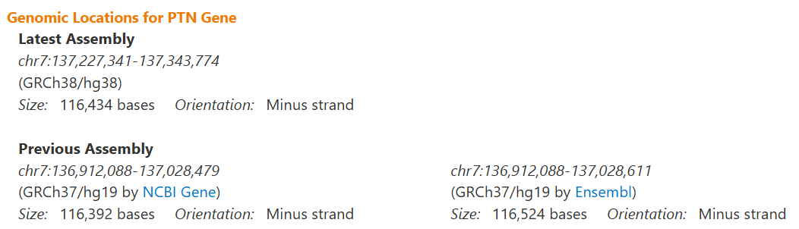

MQ-DATAMIND ECR workshop: Proteomics and Mental Health (tutorial - local
version)
================
X Shen
30 September, 2025

Welcome! This is the repository for the MQ-DATAMIND workshop,
‘Proteomics and Mental Health’ (Practical Session II)

# Aim of the session

We will use two-sample Mendelian randomisation to test causal
relationship between protein abundance and schizophrenia. Through this
tutorial, you will gain hands-on experience in handling and performing
quality check on pQTL and other types of GWAS sumstats. You will also
learn how to interpret Mendelian Randomisation findings.

# Data used in this tutorial and relevant readings

------------------------------------------------------------------------

We will use publicly available summary statistics from the [Psychiatric
Genomic
Consortium](https://pgc.unc.edu/for-researchers/download-results/) and
pQTL data from [deCODE](https://www.decode.com/summarydata/)
(Ferkingstad, E. et al. Large-scale integration of the plasma proteome
with genetics and disease). Note that the complete pQTL data requires a
simple access sign up. You can download your own version for your
analysis following the link, or you could follow this tutorial using a
local copy of pre-processed pQTL data.

Readings:

-   **pQTL**: Eldjarn, G.H., Ferkingstad, E., Lund, S.H. et
    al. Large-scale plasma proteomics comparisons through genetics and
    disease associations. Nature 622, 348–358 (2023).
    <https://doi.org/10.1038/s41586-023-06563-x>

-   **Schizophrenia GWAS**: Trubetskoy, V., Pardiñas, A.F., Qi, T. et
    al. Mapping genomic loci implicates genes and synaptic biology in
    schizophrenia. Nature 604, 502–508 (2022).
    <https://doi.org/10.1038/s41586-022-04434-5>

-   **Mendelian Randomisation analysis**: Bhattacharyya U, John J, Lam
    M, Fisher J, Sun B, Baird D, Burgess S, Chen CY, Lencz T.
    Circulating Blood-Based Proteins in Psychopathology and Cognition: A
    Mendelian Randomization Study. JAMA Psychiatry. 2025 May
    1;82(5):481-491. <https://doi.org/10.1001/jamapsychiatry.2025.0033>.

# Data preparation

------------------------------------------------------------------------

## Clone this github repo

Use the script below to clone this github repository on your local
machine:

``` bash
git clone https://github.com/xshen796/Proteomics_Workshop_Practical.git
```

## Set up your R environment to access OpenGWAS data

💡See a quick guide here if you haven’t done so:
[URL](https://github.com/xshen796/Proteomics_Workshop_Practical/blob/main/Session_ii/Setup_APItoken.md)

## Data preparation

**See
[here](https://github.com/xshen796/Proteomics_Workshop_Practical/blob/main/prep/data_prep.md)
if you need more information on how we accessed and prepared the data
for this tutorial.**

# Two-sample MR: finding causal proteins to schizophrenia using cis pQTL

------------------------------------------------------------------------

## Load R packages

``` r
library(rmarkdown)
library(dplyr)
library(data.table)
library(pbapply)
library(readr)
library(Hmisc)
library(here)
library(knitr)
library(kableExtra)
library(TwoSampleMR)
library(coloc)
```

## Load data

Let’s first load schizophrenia GWAS sumstats and pQTL data

``` r
dat.scz_gwas = read_tsv('https://storage.googleapis.com/mhp-proteomic-sumstats/scz_2022.tsv.gz')

dat.pqtl_ptn = read_tsv('https://storage.googleapis.com/mhp-proteomic-sumstats/Proteomics_SMP_PC0_3045_72_PTN_PTN_10032022_lo_annot.txt.gz') %>% mutate(eaf = effectAlleleFreq)

dat.pqtl_lag3 = read_tsv('https://storage.googleapis.com/mhp-proteomic-sumstats/Proteomics_SMP_PC0_9950_229_LAG3_LAG_3_10032022_lo_annot.txt.gz')
```

Let’s load protein annotation and see which proteins we will be looking
at

``` r
ref.somalogic = read_tsv(here::here('utils/ref_somalogic.tsv')) %>%
    dplyr::select(SeqId,UniProt,Protein_full_name,Gene,Ensembl_Gene_ID)

knitr::kable(ref.somalogic, "pipe")
```

| SeqId    | UniProt | Protein_full_name                    | Gene | Ensembl_Gene_ID |
|:---------|:--------|:-------------------------------------|:-----|:----------------|
| 3045_72  | P21246  | Pleiotrophin                         | PTN  | ENSG00000105894 |
| 9950_229 | P18627  | Lymphocyte activation gene 3 protein | LAG3 | ENSG00000089692 |

Here in this table:

-   SeqID: unique protein identifier of SOMALogic assay

-   UniProt, Protein_full_name: Uniprot ID and full name of the protein

-   Gene, Ensembl_Gene_ID: Gene symbol and Ensembl ID

## QC and prepare pQTL data (protein as exposure)

➡️ We need to select the cis region of ***PTN***. Find genomic locations
for ***PTN***
[here](https://www.genecards.org/cgi-bin/carddisp.pl?gene=PTN&keywords=PTN)

Our genome build is **GRCh37/hg19**.



``` r
gene_boundary = data.frame(lower=136912088,upper=137028479)
gene_chr = 7
```

Select cis region sumstats: 1Mb extended area of the gene region

``` r
dat.cis_pqtl_ptn = dat.pqtl_ptn %>% 
  dplyr::filter(CHR==gene_chr,BP > (gene_boundary$lower - 1000000), BP < (gene_boundary$upper + 1000000))
```

Double check if data only includes cis region

``` r
range(dat.cis_pqtl_ptn$BP)
```

    ## [1] 135912228 138028381

➡️ Keep common variants.

``` r
dat.cis_pqtl_ptn = dat.cis_pqtl_ptn %>% filter(eaf < 0.995, eaf > 0.005)
```

➡️ Keep variants that also present in the schizophrenia GWAS sumstats.

``` r
dat.cis_pqtl_ptn = dat.cis_pqtl_ptn %>% filter(SNP %in% dat.scz_gwas$SNP)
```

➡️ Select genome-wide significant genetic instruments (pval \< 5e-8).

``` r
dat.cis_sig_pqtl_ptn = dat.cis_pqtl_ptn %>% 
  dplyr::filter(pval<5e-8)
```

➡️ Clump data using the 1000 Genome central European genotype data as
reference.

``` r
dat.cis_sig_clump_pqtl_ptn = dat.cis_sig_pqtl_ptn %>% 
  clump_data(.,clump_kb=1000,clump_r2=0.001)
```

If you see any error message, it is likely that you have not set up your
R environment correctly. See this
[tutorial](https://github.com/xshen796/Proteomics_Workshop_Practical/blob/main/Session_ii/Setup_APItoken.md).

➡️ Reformat exposure data (pQTL)

``` r
dat.exposure.ptn = format_data(dat.cis_sig_clump_pqtl_ptn,type='exposure')
```

## QC and prepare schizophrenia sumstats (schizophrenia as outcome)

``` r
dat.scz.outcome = dat.scz_gwas %>% 
  format_data(.,type='outcome') 
```

## Harmonise exposure and outcome data

Harmonise exposure and outcome data. Select the top SNP for Wald ratio
test.

``` r
dat.mr =  harmonise_data(dat.exposure.ptn,dat.scz.outcome) %>%
    arrange(pval.exposure) %>%
    head(n=1)
```

    ## Harmonising 3045_72_PTN_PTN (WWlYLm) and SCZ (mI3waR)

## Run two-sample Mendelian randomisation (Wald ratio test and sign)

➡️ Use the script below to run Wald ratio test. See result below:

``` r
MR.wr=mr_wald_ratio(b_exp = dat.mr$beta.exposure,
                   b_out = dat.mr$beta.outcome,
                   se_exp = dat.mr$se.exposure,
                   se_out = dat.mr$se.outcome)  

MR.wr %>% knitr::kable(.)
```

➡️ Use the script below to run MR Steiger directionality test. Here, we
use it as a complementary analysis to Wald ratio.

``` r
MR.dir = directionality_test(dat.mr)
MR.dir %>% %>% knitr::kable(.)
```

# Colocalisation: consolidating causal evidence

------------------------------------------------------------------------

We will use the cis region pQTL data generated above for MR analyses for
colocalisation analysis. This time, we will use all the SNPs within the
cis region.
