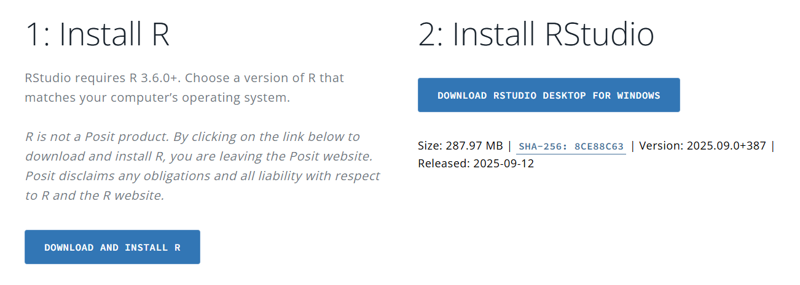

MQ-DATAMIND ECR workshop: Proteomics and Mental Health (environment set
up)
================
X Shen
22 September, 2025

Welcome! This tutorial guides through the main steps to set up your
local environment for the MQ-DATAMIND ECR workshop, ‘Proteomics and
Mental health’.

## Introduction

All scripts are written in R. You can choose to run the practical on a
jupyter notebook provided to you and run the analysis on Google Cloud,
or you could download scripts to your local computer or cluster and
perform analysis on your own device. This Setup tutorial shows you steps
to set up or local environment.

## Download R and RStudio

R and RStudio are available at the URL:
<https://posit.co/download/rstudio-desktop/>

In this page, scroll down and you will find two links for R and RStudio
respectively. Download and install the latest versions of both following
the prompts.



## Install R packages

Open RStudio, run the following commands in the console:

``` r
check_and_install_package <- function(package_name) {
  # Check if the package is already installed.
  if (!require(package_name, character.only = TRUE, quietly = TRUE)) {
    # If not installed, try to install it.
    message(paste("Package '", package_name, "' not found. Attempting to install...", sep = ""))
    
    # Use tryCatch to handle potential installation errors.
    tryCatch({
      if (package_name!='TwoSampleMR'){
        install.packages(package_name, dependencies = TRUE)
      }else if(package_name=='TwoSampleMR'){
        library(remotes)
        remotes::install_github("MRCIEU/TwoSampleMR")
      }
      
      # Try to load the package after installation.
      if (require(package_name, character.only = TRUE, quietly = TRUE)) {
        message(paste("Package '", package_name, "' installed and loaded successfully.", sep = ""))
      } else {
        # This case is rare, but good to have a fallback.
        stop("Package installed, but could not be loaded. Please check your R environment.")
      }
    }, error = function(e) {
      message(paste("Error installing package '", package_name, "': ", e$message, sep = ""))
    })
  } else {
    # If the package is already installed, just load it.
    message(paste("Package '", package_name, "' is already installed and loaded.", sep = ""))
  }
}

check_and_install_package("dplyr")
```

    ## 
    ## Attaching package: 'dplyr'

    ## The following objects are masked from 'package:stats':
    ## 
    ##     filter, lag

    ## The following objects are masked from 'package:base':
    ## 
    ##     intersect, setdiff, setequal, union

    ## Package 'dplyr' is already installed and loaded.

``` r
check_and_install_package("data.table")
```

    ## data.table 1.15.4 using 32 threads (see ?getDTthreads).

    ## Latest news: r-datatable.com

    ## 
    ## Attaching package: 'data.table'

    ## The following objects are masked from 'package:dplyr':
    ## 
    ##     between, first, last

    ## Package 'data.table' is already installed and loaded.

``` r
check_and_install_package("readr")
```

    ## Package 'readr' is already installed and loaded.

``` r
check_and_install_package("here")
```

    ## here() starts at /gpfs/igmmfs01/eddie/GenScotDepression/users/shen/ActiveProject/Proteomics_Workshop_Practical

    ## Package 'here' is already installed and loaded.

``` r
check_and_install_package("remotes")
```

    ## Package 'remotes' is already installed and loaded.

``` r
check_and_install_package("TwoSampleMR")
```

    ## TwoSampleMR version 0.6.8

    ##   [>] New authentication requirements: https://mrcieu.github.io/ieugwasr/articles/guide.html#authentication.

    ##   [>] Major upgrades to our servers completed to improve service and stability.

    ##   [>] We need your help to shape our emerging roadmap!

    ##       Please take 2 minutes to give us feedback -

    ##       https://forms.office.com/e/eSr7EFAfCG

    ## 
    ## Warning:
    ## You are running an old version of the TwoSampleMR package.
    ## This version:   0.6.8
    ## Latest version: 0.6.22
    ## Please consider updating using remotes::install_github('MRCIEU/TwoSampleMR')

    ## 
    ## Attaching package: 'TwoSampleMR'

    ## The following object is masked from 'package:remotes':
    ## 
    ##     add_metadata

    ## Package 'TwoSampleMR' is already installed and loaded.

The code should be able to check if you have installed the packages
correctly. Contact Xueyi Shen (<xueyi.shen@ed.ac.uk>) if you run into
any issue.

## Readings

Optional readings regarding the datasets we will use:

Readings:

-   Schizophrenia GWAS: Eldjarn, G.H., Ferkingstad, E., Lund, S.H. et
    al. Large-scale plasma proteomics comparisons through genetics and
    disease associations. Nature 622, 348–358 (2023).
    <https://doi.org/10.1038/s41586-023-06563-x>

-   Trubetskoy, V., Pardiñas, A.F., Qi, T. et al. Mapping genomic loci
    implicates genes and synaptic biology in schizophrenia. Nature 604,
    502–508 (2022). <https://doi.org/10.1038/s41586-022-04434-5>

## What next

Additional scripts and mock data will become available prior to the
workshop.
