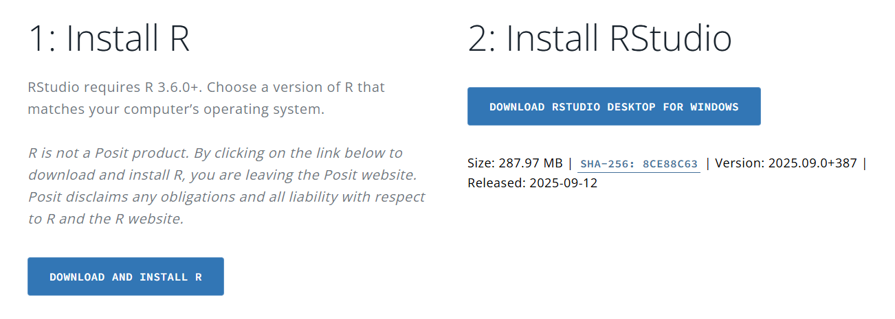

MQ-DATAMIND ECR workshop: Proteomics and Mental Health (environment set
up)
================
X Shen
06 October, 2025

Welcome! This tutorial guides through the main steps to set up your
local environment for the MQ-DATAMIND ECR workshop, ‘Proteomics and
Mental health’.

## Introduction

All scripts are written in R. You can choose to run the practical on a
jupyter notebook provided to you and run the analysis on Google Cloud,
or you could download scripts to your local computer or cluster and
perform analysis on your own device. This Setup tutorial shows you steps
to set up or local environment.

## Download R and RStudio

R and RStudio are available at the URL:
<https://posit.co/download/rstudio-desktop/>

In this page, scroll down and you will find two links for R and RStudio
respectively. Download and install the latest versions of both following
the prompts.



## Install R packages

Open RStudio, run the following commands in the console:

``` r
check_and_install_package <- function(package_name) {
  # Check if the package is already installed.
  if (!require(package_name, character.only = TRUE, quietly = TRUE)) {
    # If not installed, try to install it.
    message(paste("Package '", package_name, "' not found. Attempting to install...", sep = ""))
    
    # Use tryCatch to handle potential installation errors.
    tryCatch({
      if (package_name!='TwoSampleMR'){
        install.packages(package_name, dependencies = TRUE)
      }else if(package_name=='TwoSampleMR'){
        library(remotes)
        remotes::install_github("MRCIEU/TwoSampleMR")
      }else if(package_name=='coloc'){
        library(remotes)
        remotes::install_github("chr1swallace/coloc@main",build_vignettes=TRUE)
      }
      
      # Try to load the package after installation.
      if (require(package_name, character.only = TRUE, quietly = TRUE)) {
        message(paste("Package '", package_name, "' installed and loaded successfully.", sep = ""))
      } else {
        # This case is rare, but good to have a fallback.
        stop("Package installed, but could not be loaded. Please check your R environment.")
      }
    }, error = function(e) {
      message(paste("Error installing package '", package_name, "': ", e$message, sep = ""))
    })
  } else {
    # If the package is already installed, just load it.
    message(paste("Package '", package_name, "' is already installed and loaded.", sep = ""))
  }
}

check_and_install_package("dplyr")
check_and_install_package("data.table")
check_and_install_package("readr")
check_and_install_package("here")
check_and_install_package("remotes")
check_and_install_package("TwoSampleMR")
check_and_install_package("coloc")
check_and_install_package("GenomicsFeatures")
check_and_install_package("rtracklayer")

check_and_install_package("rmarkdown")
check_and_install_package("Hmisc")
check_and_install_package("dplyr")
check_and_install_package("stringr")
check_and_install_package("tidyr")
check_and_install_package("ggplot2")
check_and_install_package("survival")
check_and_install_package("broom")
check_and_install_package("lspline")
check_and_install_package("patchwork")
check_and_install_package("UpSetR")

if (!require("BiocManager", quietly = TRUE))
    install.packages("BiocManager")
BiocManager::install("rtracklayer")
BiocManager::install("GenomicAlignments")
```

The code should be able to check if you have installed the packages
correctly. Contact Xueyi Shen (<xueyi.shen@ed.ac.uk>) if you run into
any issue.

## Optional packages for visualisation

Use code below to install some optional packages for visualisation.
These packages are used to visualise some of the results in the tutorial
and won’t effect the analysis.

``` r
if (!requireNamespace("BiocManager", quietly = TRUE))
  install.packages("BiocManager")
BiocManager::install("ensembldb")
BiocManager::install("EnsDb.Hsapiens.v75")

if (!requireNamespace("devtools", quietly = TRUE))
  install.packages("devtools")
devtools::install_github("myles-lewis/locuszoomr")
```

## Set up your API token

See a quick guide
[here](https://github.com/xshen796/Proteomics_Workshop_Practical/blob/main/Session_ii/Setup_APItoken.md)

## Clone this respository (optional)

Clone this repository to save a copy of all the scripts in your local
device. Note that this is optional for the workshop, but you can feel
free to explore this option in your own time. We recommend using the
cloud service (see
[README](https://github.com/xshen796/Proteomics_Workshop_Practical/tree/main)).

``` r
git clone https://github.com/xshen796/Proteomics_Workshop_Practical.git
```

## Readings

Optional readings on the datasets we will use:

Readings:

-   Session I:

    -   Sun BB, Suhre K, Gibson BW. Promises and Challenges of
        populational Proteomics in Health and Disease. Mol Cell
        Proteomics. 2024 Jul;23(7):100786.
        <https://doi.org/10.1016/j.mcpro.2024.100786>

    Broader perspective: This paper explains how new proteomic
    technologies allow researchers to measure thousands of proteins in
    large populations, helping to find biomarkers and improve disease
    prediction. It highlights both the opportunities and challenges of
    using proteomics in large-scale studies.

    -   Schuermans, A., Pournamdari, A.B., Lee, J. et al. Integrative
        proteomic analyses across common cardiac diseases yield
        mechanistic insights and enhanced prediction. Nat Cardiovasc Res
        3, 1516–1530 (2024).
        <https://doi.org/10.1038/s44161-024-00567-0>

    Example of method integration (cardiac diseases): This study
    integrates large-scale proteomics with epidemiological analyses,
    Mendelian randomization, and prediction modelling to identify
    proteins linked to major cardiac diseases and highlight potential
    therapeutic targets using UK Biobank data.

-   Session II:

    -   Bhattacharyya U, John J, Lam M, Fisher J, Sun B, Baird D,
        Burgess S, Chen CY, Lencz T. Circulating Blood-Based Proteins in
        Psychopathology and Cognition: A Mendelian Randomization Study.
        JAMA Psychiatry. 2025 May 1;82(5):481-491.
        <https://doi.org/10.1001/jamapsychiatry.2025.0033>.
