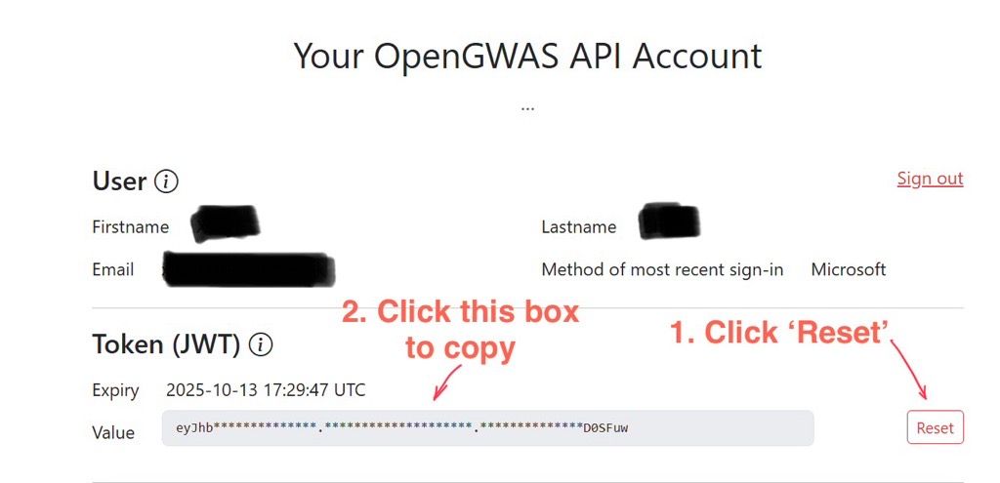
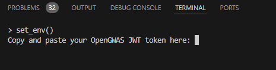
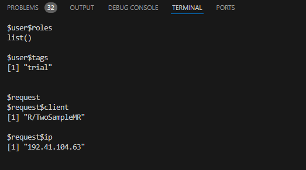

Set up your OpenGWAS API key
================

## Aim

This tutorial shows you how you can set up your OpenGWAS API key to
access the full functionality of the OpenGWAS database.

## Get your OpenGWAS API token

Go to <https://api.opengwas.io/> and sign up for an account. Once you
have signed up, navigate to account page (top right corner of the
webpage). You should be able to see a webpage like this:



## Set up environment

Copy and paste commands below in your R console:

``` r
library(here)
source(here::here('utils/misc.R'))

# Run environment function
set_env()
```

A prompt will show up in your console like this:



Copy and paste your API token here in the R terminal (see ‘Get your
OpenGWAS API token’ section above).

If you don’t see any error message. Your environment should be ready.

Normal outputs should look like this:


